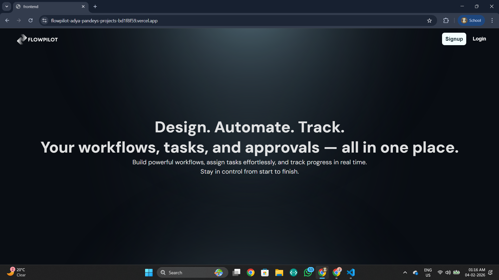
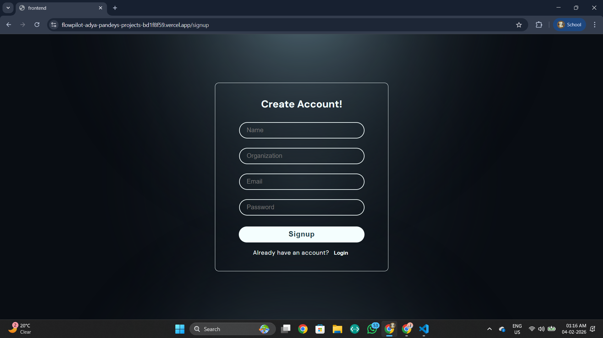
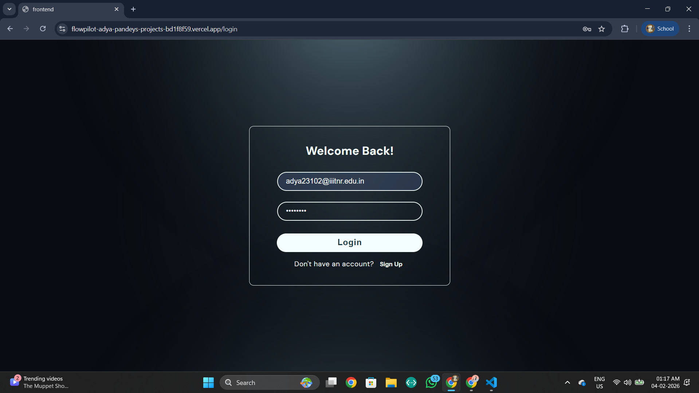
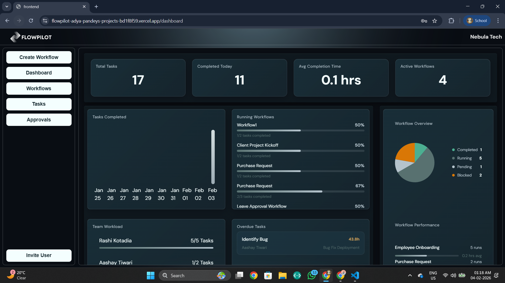
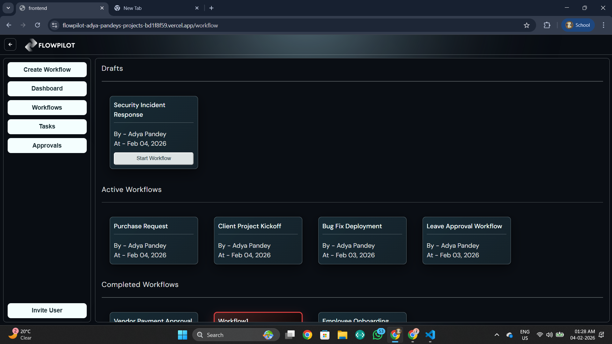
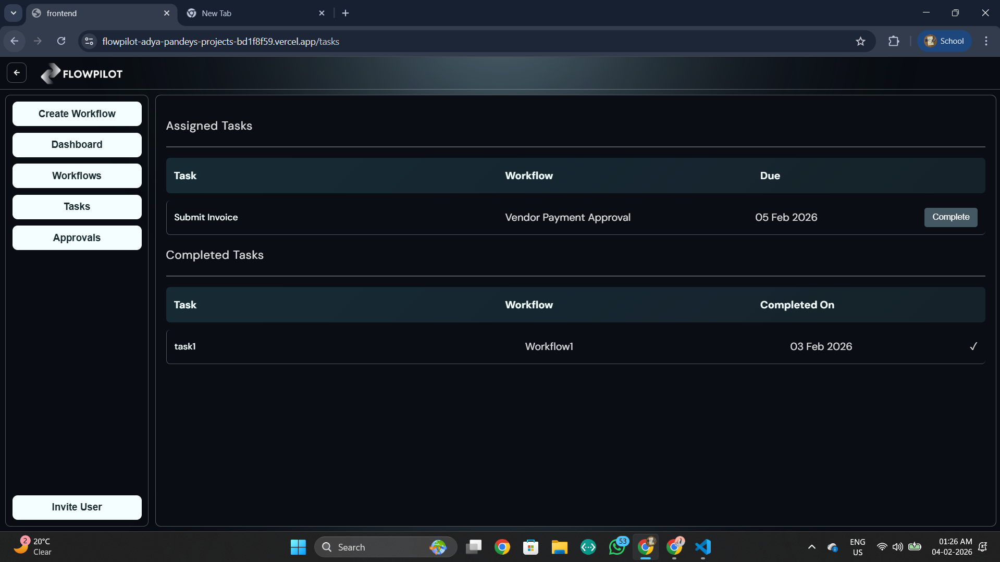
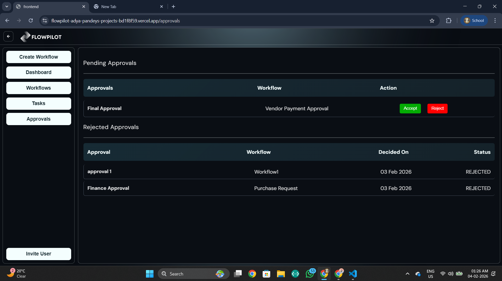

# 🚀 Multi-Tenant SaaS Workflow & Operations Management Platform

A cloud-based SaaS platform that enables organizations to design workflows, assign tasks, manage approvals, and monitor execution through real-time dashboards and analytics.

This system separates **workflow design (blueprint)** from **workflow execution (runtime tasks)** and supports multi-tenant architecture where multiple organizations operate securely in the same system.

---

##  Features

###  Authentication & Authorization
- User Signup & Login
- JWT-based authentication
- Token stored in HTTP-only cookies and Authorization headers
- Role-Based Access Control (ADMIN, MANAGER, EMPLOYEE)

###  Multi-Tenant Organization System
- Each user belongs to an organization
- Data isolated per organization
- Admin can invite users and assign roles

###  Workflow Builder
- Visual drag-and-drop workflow editor
- Task and Approval nodes
- Directed Acyclic Graph (DAG) validation
- Save Draft & Publish workflows

###  Workflow Execution Engine
- Start workflows manually
- Root nodes generate initial tasks
- Completing a task unlocks next nodes
- Deterministic execution

###  Approval Engine
- Approval nodes create BLOCKED tasks
- Managers/Admins approve or reject
- Approved tasks unlock next steps

###  Task Management
- Task states:
  - PENDING
  - IN_PROGRESS
  - DONE
  - BLOCKED
- Start / Complete / Block tasks

###  Dashboard & Analytics
- KPI cards
- Task status distribution
- Workflow performance
- Bottlenecks
- User workload
- Pending approvals

---

---

##  Screenshots

> Below are some key screenshots demonstrating major features of the platform.

###  Home


###  Authentication (Signup / Login)



###  Dashboard


###  Workflow Builder


###  Workflows List


###  Tasks Page


###  Approval Screen


---

##  Tech Stack

### Frontend
- React
- React Flow
- Axios
- CSS

### Backend
- Node.js
- Express.js
- Prisma ORM
- PostgreSQL
- JWT
- Cookie-parser

---

##  Authentication Flow

1. User logs in
2. Backend generates JWT
3. JWT is:
   - Stored in HTTP-only cookie
   - Also usable via Authorization header
4. Auth middleware verifies JWT
5. User context attached to request:
   ```js
   req.user = { userId, orgId, role }


##  System Architecture

```text
Frontend (React)
       ↓
REST API (Express)
       ↓
Business Services
       ↓
Prisma ORM
       ↓
PostgreSQL
```

##  Workflow Lifecycle

```text
Design Workflow → Save
      ↓
Publish Workflow
      ↓
Start Workflow
      ↓
Create Root Tasks
      ↓
Complete Task
      ↓
Unlock Next Node
      ↓
If Approval → Wait for Decision
```

##  Backend Folder Structure

```text
src/
 ├─ modules/
 ├─ middlewares/
 ├─ config/
 └─ app.js

```

##  Frontend Folder Structure
```text
src/
 ├─ api/
 ├─ pages/
 ├─ components/
 ├─ context/
 ├─ styles/
 └─ App.jsx
```

##  Environment Variables
```text
DATABASE_URL=
JWT_SECRET=
PORT=

```


